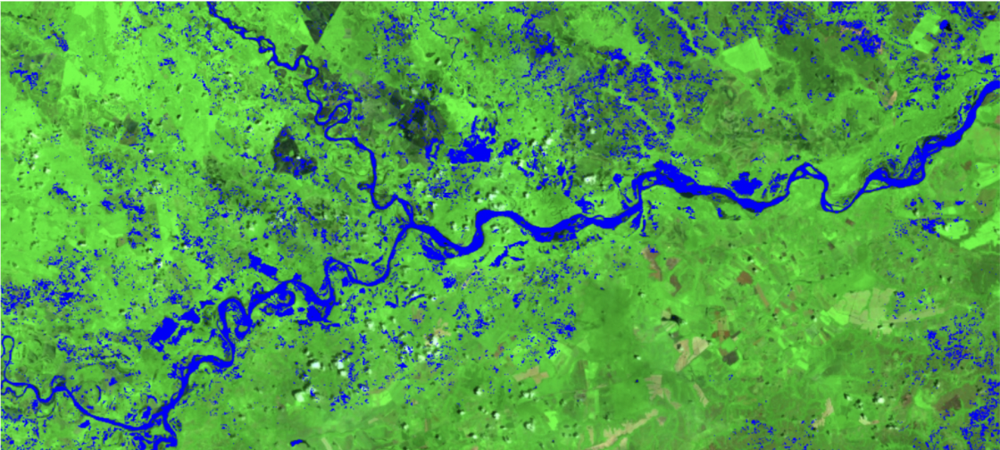
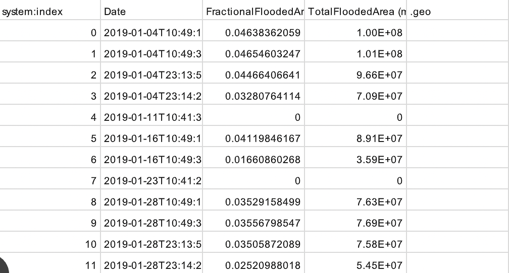

# Colombia-ML-Flood-Mapping
Includes both single flood event visualization and time series mode. 

**Time Series Mode:** Google Earth Engine (GEE) algorithm for measuring daily inundated area across a specified region of interest and date range.

**Single Flood Event Mode:** Use the Colombia_Random_Forest GEE script to visualize a single flood event.

## Main Data Inputs for Time Series

Start date, end date, region of interest, and training data can all be inputted on lines 174-181.

## Data Outputs
#### Single Flood Event Mode:
Returns a GEE image with a "classification band" - i.e. the output of classifying the given flood event using the created classifier. The image can also added as a Map layer on line 134.

_Example_: [October 2019 Flood Event in the Villavicencio municipality of Meta] (https://code.earthengine.google.com/aec073442353a6d33f4042c4f3a9495c)

#### Time Series Mode:
Exports a CSV file with the following columns: Date, Fractional Flooded Area, Total Flooded Area.

_Example_: [January 2019 Time Series for the Ayapel municipality of Córdoba] (https://code.earthengine.google.com/fb0eab5fcff4b894e5fcda2bca6cf115)

## Training Data
  - If running this algorithm for the Córdoba or Meta departments, then use the training data available in this repository.
  - If running for algorithms, then use the following process:
    1. Draw geometries in GEE, half of which cover water and the other half which cover non-water regions during different flood events. Be as specific as possible in these geometries, and cross-compare images from Sentinel-1, Sentinel-2, or Planetscope during each flood event's date range to verify that the water and non-water geometries are accurate.
    2. For each flood event, convert its geometries into two feature collections (water and non-water), and add a 'flood' property to each collection where the non-water collection is set to 0 and water collection is set to 1.
    3. Sample 5000 pixels from each feature collection.
    4. Merge the samples from all flood events to create the final training dataset of pixels.

## About the Algorithm

This algorithm uses a Random Forest approach to classify floods based on the following properties and image collections:
- Sentinel-1
  - VV polarization
  - VH polarization
  - VV/VH ratio
  - VV annual variance
  - VH annual variance
- Sentinel-2
  - Normalized difference water index
  - Normalized difference vegetation index
- SRTM Elevation
  - Elevation
  - Slope
